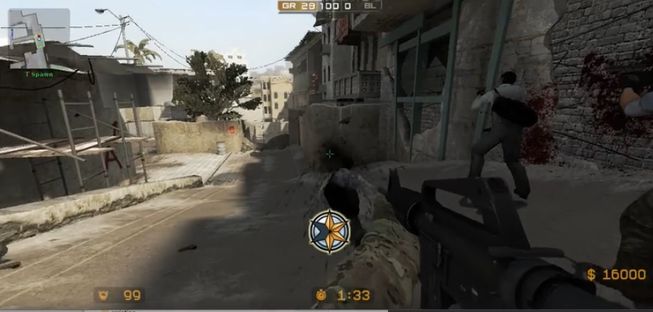

# HL2 BASE HOOK
### Example HL2SDK hook for CSS

## screen shot


## Description and features
- HLSDK2
- Load , draw tga image
- Killmark effect example
- Scoreboard example
- Player ui example
- Using message to control by plugin (EventMessage.cpp->HookEventMessage_2)
## Usage
Build with visual studio 2010 or late

Using dllinject tool (below)
```C
#undef UNICODE
#include <iostream>
#include <string>
#include <ctype.h>
#include <Windows.h>
#include <tlhelp32.h>
#include <Shlwapi.h>
#pragma comment(lib, "Shlwapi.lib")

using namespace std;

int getProcID(const string& p_name);
bool InjectDLL(const int &pid, const string &DLL_Path);
void usage();

int main(int argc, char ** argv)
{
	  
	char buf[MAX_PATH] = { 0 };
	int a;
	// dll path
	GetFullPathName("CSS.dll", MAX_PATH, buf, NULL);
	cout << "DLL Path: " << buf;
	// inject
	InjectDLL(getProcID("hl2.exe"), buf);
 
	cin >> a;
	return EXIT_SUCCESS;
}

int getProcID(const string& p_name)
{
	HANDLE snapshot = CreateToolhelp32Snapshot(TH32CS_SNAPPROCESS, 0);
	PROCESSENTRY32 structprocsnapshot = { 0 };

	structprocsnapshot.dwSize = sizeof(PROCESSENTRY32);

	if (snapshot == INVALID_HANDLE_VALUE)return 0;
	if (Process32First(snapshot, &structprocsnapshot) == FALSE)return 0;

	while (Process32Next(snapshot, &structprocsnapshot))
	{
		if (!strcmp(structprocsnapshot.szExeFile, p_name.c_str()))
		{
			CloseHandle(snapshot);
			cout << "[+]Process name is: " << p_name << "\n[+]Process ID: " << structprocsnapshot.th32ProcessID << endl;
			return structprocsnapshot.th32ProcessID;
		}
	}
	CloseHandle(snapshot);
	cerr << "[!]Unable to find Process ID" << endl;
	return 0;

}

bool InjectDLL(const int &pid, const string &DLL_Path)
{
	long dll_size = DLL_Path.length() + 1;
	HANDLE hProc = OpenProcess(PROCESS_ALL_ACCESS, FALSE, pid);

	if (hProc == NULL)
	{
		cerr << "[!]Fail to open target process!" << endl;
		return false;
	}
	cout << "[+]Opening Target Process..." << endl;

	LPVOID MyAlloc = VirtualAllocEx(hProc, NULL, dll_size, MEM_COMMIT, PAGE_EXECUTE_READWRITE);
	if (MyAlloc == NULL)
	{
		cerr << "[!]Fail to allocate memory in Target Process." << endl;
		return false;
	}

	cout << "[+]Allocating memory in Targer Process." << endl;
	int IsWriteOK = WriteProcessMemory(hProc , MyAlloc, DLL_Path.c_str() , dll_size, 0);
	if (IsWriteOK == 0)
	{
		cerr << "[!]Fail to write in Target Process memory." << endl;
		return false;
	}
	cout << "[+]Creating Remote Thread in Target Process" << endl;

	DWORD dWord;
	LPTHREAD_START_ROUTINE addrLoadLibrary = (LPTHREAD_START_ROUTINE)GetProcAddress(LoadLibrary("kernel32"), "LoadLibraryA");
	HANDLE ThreadReturn = CreateRemoteThread(hProc, NULL, 0, addrLoadLibrary, MyAlloc, 0, &dWord);
	if (ThreadReturn == NULL)
	{
		cerr << "[!]Fail to create Remote Thread" << endl;
		return false;
	}

	if ((hProc != NULL) && (MyAlloc != NULL) && (IsWriteOK != ERROR_INVALID_HANDLE) && (ThreadReturn != NULL))
	{
		cout << "[+]DLL Successfully Injected :)" << endl;
		return true;
	}

	return false;
}
```
